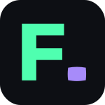
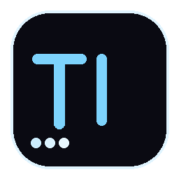

# Renato Lima

### Full Stack Developer · JavaScript · TypeScript · React · Node.js

---

### Sobre mim

Desenvolvedor Full Stack com foco em TypeScript, React e Node.js. Construo aplicações web, desktop e PWAs — do front ao back, com testes e deploy. Fundador da **SEDLABS**, softhouse focada em soluções sob medida.

---

 

 

Softhouse própria — desenvolvimento de software personalizado para clientes, 
do MVP ao produto completo.

 

---

### Stack

---

### Projetos em Destaque

| App | Descrição | Stack |
|:---:|---|---|
|  | Converte arquivos `.docx`, `.odt`, `.md` e outros em XML para o Moodle — processamento 100% local, sem upload. 92% de cobertura de testes. | TS · React · Vite · Tailwind · Zustand · Vitest · Playwright |
|  | PWA offline para controle de treinos com progressão automática de carga, timer de descanso, gráficos de frequência e exportação em PDF. Sem conta, sem backend. | JS · React · PWA · localStorage |
|  | App desktop de notas flutuantes com overlay always-on-top, atalhos globais, modo click-through e bundle < 5MB. | TS · React · Tauri · Rust · Zustand |
|  | App colaborativo para grupos decidirem onde sair — votação em tempo real via WebSockets, autenticação JWT e salas por código. | JS · Node.js · Socket.io · Express · MySQL · Sequelize |

---

### GitHub Stats

